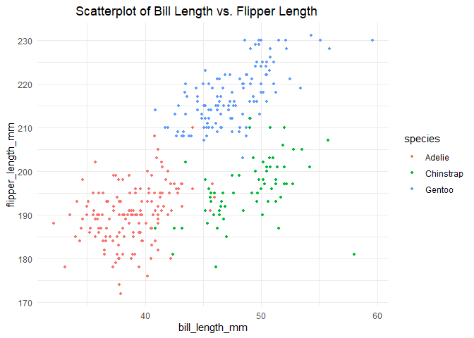

p8105_hw1_ez2384
================
2024-09-21

### **Problem 0.1, 0.2, and loading relevant packages**

``` r
  library("ggplot2")
  library("tidyverse")
```

### **Problem 1**

Load the PENGUINS dataset

``` r
  data("penguins", package = "palmerpenguins")
```

Description of the PENGUINS dataset:

``` r
  ?penguins
```

- 8 Variables:
  - SPECIES (a factor denoting penguin species)
  - ISLAND (a factor denoting island in Palmer Archipelago, Antarctica)
  - BILL_LENGTH_MM (a number denoting bill length (millimeters))
  - BILL_DEPTH_MM (a number denoting bill depth (millimeters))
  - FLIPPER_LENGTH_MM (an integer denoting flipper length (millimeters))
  - BODY_MASS_G (an integer denoting body mass (grams))
  - SEX (a factor denoting penguin sex (female, male))
  - YEAR (an integer denoting the study year (2007, 2008, or 2009))
- Size of the Dataset: 344 x 8

``` r
        nrow(penguins)
```

    ## [1] 344

``` r
        ncol(penguins)
```

    ## [1] 8

- Mean flipper length

``` r
        mean(penguins$flipper_length_mm, na.rm=TRUE)
```

    ## [1] 200.9152

- Scatterplot

``` r
ggplot(penguins, aes(x = bill_length_mm, y = flipper_length_mm)) + geom_point(aes(color = species), na.rm=TRUE, size=1) + theme_minimal() + ggtitle("Scatterplot of Bill Length vs. Flipper Length") + theme(plot.title = element_text(hjust = 0.35))
```

<!-- -->

### **Problem 2**

Create the Desired Dataframe

``` r
  set.seed(2048)      # Select a pseudo random seed for replication purposes
  DF <- data.frame(
          random_sample = rnorm(10),
          char_vector   = letters[1:10],
          factor_vector = factor(sample(c("LEVEL1", "LEVEL2", "LEVEL3"), size = 10, replace = TRUE))  # To randomly select from the 3 levels
  )
  DF$logical_vector <- DF$random_sample>0
```

Compute the Means for Each Column and Discuss whether Applicable

``` r
  mean(DF[["random_sample"]])   # Mean() works for numeric data column
```

    ## [1] -0.4901851

``` r
  mean(DF[["logical_vector"]])  # Mean() works for logical data column, treating TRUE as 1 and FALSE as 0
```

    ## [1] 0.2

``` r
  mean(DF[["char_vector"]])     # Mean() does NOT work for character data types, returning NA
```

    ## Warning in mean.default(DF[["char_vector"]]): 参数不是数值也不是逻辑值：返回NA

    ## [1] NA

``` r
  mean(DF[["factor_vector"]])   # Mean() does NOT work for factor data column, returning NA
```

    ## Warning in mean.default(DF[["factor_vector"]]):
    ## 参数不是数值也不是逻辑值：返回NA

    ## [1] NA

Applying as.numeric() to the logical, character, and factor variables.
Discuss what happens and the reasoning.

``` r
  conv_num_vector = as.numeric(DF$logical_vector)  # conversion successful: treating TRUE as 1 and FALSE as 0
  conv_num_char   = as.numeric(DF$char_vector)     # warning appears, then returns NA throughout
```

    ## Warning: 强制改变过程中产生了NA

``` r
  conv_num_factor = as.numeric(DF$factor_vector)   # conversion successful: treating the LEVEL CODE of the factor as 1, 2, 3 for the three levels specified
```
